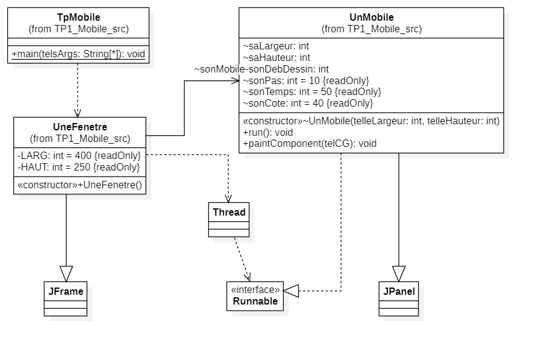
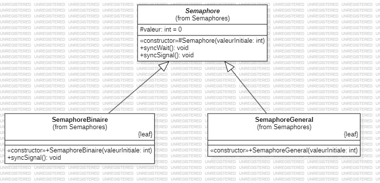
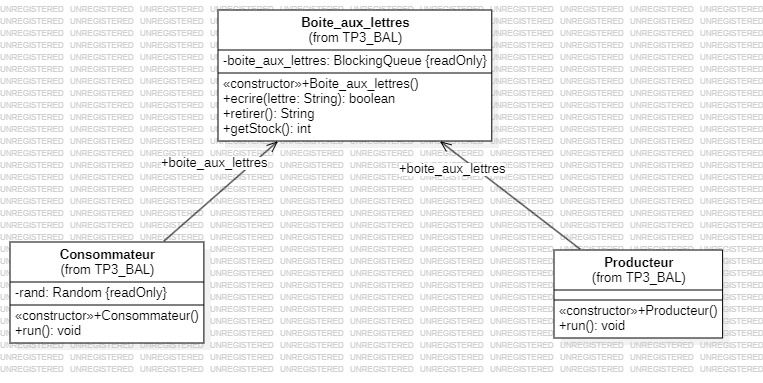

# Rapport - Introduction à la Programmation Répartie - Programmation Avancée

Chakib OUALI - 3FA - 2024

---

## Introduction

Ce rapport concerne les travaux pratiques de programmation avancée. Il traite notamment la notion de programmation
répartie notamment parallèle et concurrente.
A la différence de la programmation séquentielle, la programmation parallèle permet d'exécuter plusieurs tâches en
même temps. La programmation concurrente permet d'exécuter plusieurs tâches en même temps mais de manière
interrompue.
Le tableau ci-dessous résume les différences entre la programmation séquentielle, parallèle et concurrente.

| Type de Programmation | Description | Objectif Principal|
|----------|----------|----------|
| **Séquentielle**| Les instructions s’exécutent une par une, de manière linéaire. | Simplicité, structure ordonnée |
| **Parallèle**| Divise une tâche en sous-tâches exécutées simultanément sur plusieurs unités de calcul (multi-cœur, GPU).| Accélération du traitement pour les tâches indépendantes |
| **Concurrente**| Permet l’intercalage de plusieurs tâches qui progressent de manière alternée (peuvent sembler simultanées mais utilisent une même unité de calcul). | Optimisation de l’utilisation des ressources, réactivité |

Les travaux sont effectués sur les machines de l'IUT (ou ma machine personnelle) qui sont des machines à mémoire partagée. Une machine à mémoire partager indique que chaque processeur a accès à la même mémoire. A la différence d'une machine à mémoire distribuée où chaque processeur a sa propre mémoire et communique par réseau.

Les travaux sont réalisés en Java.
Le premier TP concerne la création d'une fenêtre graphique avec un mobile se déplaçant de gauche à droite. Le mobile
doit repartir en sens inverse lorsqu'il atteint une extrémité de la fenêtre.
Le second TP introduit les notions de section critique, de ressource critique et de sémaphores. En affichant simplement
des lettres dans la console, il s'agit de gérer l'ordre d'affichage des lettres pour qu'elles soient affichées dans un ordre dépendant uniquement de l'algorithme d'élection.
Le TP numéro 3 consiste à créer une boîte aux lettres sous la forme de Producteur-Consommateur. Le producteur écrit des lettres dans la boîte aux lettres et le consommateur les lit. Le producteur et le consommateur sont des threads différents.

## TD / TP 1 Mobile

### Mobile : Analyse des sources / Introduction

Le TP 1 Mobile présente une fenêtre graphique avec un mobile qui se déplace à chaque extrémité de la fenêtre.
On retrouve les classes suivantes :
`TPMobile` : classe principale qui contient la méthode `main` pour lancer l'application.
`UnMobile` : classe qui hérite de `JPanel` et qui dessine le mobile.
`UneFenetre` : classe qui hérite de `JFrame` et qui affiche la fenêtre.



### Mobile : Implémentation

> Ecrire une classe `TP_1_Mobile.UneFenetre` dérivant de JFrame, cette classe aura un champ `TP_1_Mobile.UnMobile
> sonMobile`, son constructeur devra ajouter `sonMobile` à la fenêtre, créer une thread avec `sonMobile`,
> afficher la fenêtre et lancer la thread.

La classe `TP_1_Mobile.UneFenetre` est définie dans le fichier `TP_1_Mobile.UneFenetre.java` :

Il faut instancier un objet de type `TP_1_Mobile.UnMobile` (appelé `mobileTask`), l'ajouter à la fenêtre, créer une
thread (appelé `mobileThread`), afficher la fenêtre (et la paramétrer) et lancer la thread.
Les opérations peuvent être faites peu importe l'ordre, il ne s'agit pas de programmation séquentielle.

```java
public TP_1_Mobile.UneFenetre() {
    mobileTask = new TP_1_Mobile.UnMobile(LARG, HAUT);
    add(mobileTask); // ajouter sonMobile a la fenêtre
    Thread mobileThread = new Thread(mobileTask); // créer une thread mobileThread avec sonMobile
    setSize(LARG, HAUT); // définir la taille de la fenêtre
    setDefaultCloseOperation(JFrame.EXIT_ON_CLOSE); // définir l'opération de fermeture par défaut
    setVisible(true);// afficher la fenêtre
    mobileThread.start(); // lancer mobileThread
}
```

L'ordre suivant fonctionne tout autant que le précédent.

```java
public TP_1_Mobile.UneFenetre() {
    mobileTask = new TP_1_Mobile.UnMobile(LARG, HAUT);
    Thread mobileThread = new Thread(mobileTask); // créer une thread mobileThread avec sonMobile
    mobileThread.start(); // lancer mobileThread
    setSize(LARG, HAUT); // définir la taille de la fenêtre
    setDefaultCloseOperation(JFrame.EXIT_ON_CLOSE); // définir l'opération de fermeture par défaut
    setVisible(true);// afficher la fenêtre
    add(mobileTask); // ajouter sonMobile a la fenêtre
}
```

---
> Faire en sorte que le mobile reparte en sens inverse lorsqu'il atteint une extrémité de la fenêtre

Il suffit de modifier la méthode `run` de la classe `TP_1_Mobile.UnMobile` pour que le mobile reparte en sens inverse
lorsqu'il atteint une extrémité de la fenêtre.

```java
// pour revenir à gauche
for(sonDebDessin =saLargeur -sonPas;sonDebDessin >0;sonDebDessin -=sonPas){
    // la position de départ est saLargeur - sonPas, c'est-à-dire la position d'arrêt de la première boucle,
    // on décrémente sonDebDessin de sonPas pour revenir à gauche
    repaint();
    try{
        Thread.sleep(sonTemps);
    } catch(InterruptedException telleExcp){
        telleExcp.printStackTrace();
        }
    }
```

Pour que l'aller-retour du mobile boucle indéfiniment.

```java
while(!Thread.currentThread().isInterrupted()){
    // aller retour
}
```

---

#### Mobile : Utilisation des Sémaphores

Après avoir introduit les sémaphores lors du TP 2, il est possible de les utiliser pour gérer la section critique
dans le TP 1 Mobile.

Un sémaphore est une variable qui permet de contrôler l'accès à une ressource critique.
Dans un package `Semaphores`, on trouve les classes `Semaphores`, `SemaphoreBinaire` et `SemaphoreGeneral`.

Les classes `SemaphoreBinaire` et `SemaphoreGeneral` sont des classes qui héritent de la classe `Semaphores` qui elle
est une classe abstraite.

Diagramme UML des classes du package Semaphores :

[](assets/Semaphores_UML.jpg)

En utilisant la classe `Semaphore`, il est possible de gérer la section critique d'un programme en le surchargeant avec les fonctions `syncWait` et `syncSignal`.

Pour utiliser un sémaphore binaire pour gérer la section critique dans le TP 1 Mobile, il faut procéder ainsi :

1. Instancier `Semaphores.SemaphoreBinaire` en tant que variable statique.
2. Utiliser `sem.syncWait()` avant la boucle `for` pour attendre l'accès à la section critique.
3. Utiliser `sem.syncSignal()` après la boucle `for` pour libérer l'accès à la section critique.

```java
public class TP_1_Mobile {
    private static Semaphores.SemaphoreBinaire sem = new Semaphores.SemaphoreBinaire(1);

    public void run() {
        while (!Thread.currentThread().isInterrupted()) {
            // Aller
            sem.syncWait();
            //...
            sem.syncSignal();

            // Retour
            sem.syncWait();
            //...
            sem.syncSignal();
        }
    }
}
```

Ainsi, un seul mobile pourra accéder à la section critique à la fois.

Pour que chaque mobile ai une vitesse différente, il suffit de modifier la valeur de `sonTemps`.

```java
int sonTemps = (int) (Math.random() * ((40 - 5) + 1)) + 5;
```

#### Mobile : Utilisation de `synchronized` en Java

Le mot-clé `synchronized` en Java est utilisé pour verrouiller une ressource, garantissant qu'un seul thread peut accéder à la section critique à la fois. Lors de l'utilisation de `synchronized`, il est important de spécifier la ressource correcte à verrouiller. Par exemple, si la ressource partagée est une classe, vous devez synchroniser sur la classe elle-même :

```java
synchronized (JPanel.class) {
    // Code de la section critique
}
```

> NB: Utiliser juste `JPanel` sans `.class` ne fonctionnera pas, car `JPanel` est une instance de classe et non la classe elle-même.

## TD / TP 3 : Boîte aux lettres

### Boîte aux lettres : Analyse des sources / Introduction

Ce TP contient les classes `Boite_aux_lettres`, `Producteur` et `Consommateur` (ainsi que `Main` pour lancer le programme).

La classe `Boite_aux_lettres` est une classe qui contient une liste de lettres (de type `String`) et qui permet d'ajouter et de retirer des lettres.
La liste de lettre est de type `BlockingQueue` pour permettre une synchronisation entre les threads. Ainsi, le producteur et le consommateur peuvent accéder à la liste de lettres sans conflit.

La classe `Producteur` est une classe qui hérite de `Thread` et qui permet d'ajouter des lettres à la boîte aux lettres.

La classe `Consommateur` est une classe qui hérite de `Thread` et qui permet de lire les lettres de la boîte aux lettres.

La classe `Main` permet de lancer le programme.

Diagramme UML des classes du TP 3 Boîte aux lettres :

[](assets/TP_3_BAL_UML.jpg)

### Boîte aux lettres : Implémentation

#### Boîte aux lettres : Boîte aux lettres simple

Dans un premier temps, on implémente les fonctions `ecrire` et `retirer` sans l'interface `BlockingQueue`, avec qu'une seule lettre à la fois.

Pour cela, la classe boîte aux lettres contient un champs `lettre` et un champs `disponible` pour indiquer si une lettre est disponible.

```java

private String lettre;
private boolean disponible = false;
```

Ensuite, dans des méthodes synchronisées (avec `synchronized`), on ajoute et on retire une lettre.
Pour chaque méthode, on vérifie si une lettre est disponible (écrire) ou non (retirer), si la boîte aux lettres est respectivement vide ou pleine, on écrit ou retire une lettre. Sinon, on initie une exception.

```java
public synchronized void ecrire(String lettre) throws Exception {
    if (disponible) {
        this.lettre = lettre;
        disponible = false;
    } else {
        throw new Exception("La boite est pleine");
    }
}
public synchronized String retirer() throws Exception {
    if (!disponible) {
        disponible = true;
        return lettre;
    } else {
        throw new Exception("La boite est vide");
    }
}
```

Les classes `Producteur` et `Consommateur` vont simplement avoir un champs `boite_aux_lettres` et les méthodes `run` vont appeler les méthodes `ecrire` et `retirer` de la classe `Boite_aux_lettres`.

Avec cette implémentation, le producteur écrit une lettre dans la boîte aux lettres et le consommateur la retire.

#### Boîte aux lettres : Boîte aux lettres avec `BlockingQueue`

En se basant sur le [cours du blog de José Paumard](https://blog.paumard.org/cours/java-api/chap05-concurrent-queues.html), on implémente la boîte aux lettres de la même manière que la boulangerie.

Le comportement attendu est que le thread producteur ajoute des lettres à la boîte aux lettres et que le thread consommateur les retire et les affiche.

La classe `Boite_aux_lettres` encapsule en quelque sorte une zone mémoire et les méthodes `ecrire` et `retirer` sont des wrappers de `offer` et `poll` de l'interface `BlockingQueue`. L'interface `BlockingQueue` est un monitor qui permet de gérer l'accès à la ressource partagée.

La boîte aux lettres implémente désormais l'interface `BlockingQueue` et contient une liste de lettres.

Pour ajouter et retirer des lettres, on utilise les méthodes `offer` et `poll` de l'interface `BlockingQueue`.

La classe `Producteur` ajoute à la suite toutes les lettres de l'alphabet à la boîte aux lettres à une vitesse de 0.5 lettre par seconde.

Si la boîte aux lettres n'est pas pleine, il ajoute la lettre, sinon il affiche que la boîte est pleine.

```java
public void run() {
    // ...
    for (char lettre = 'A'; lettre <= 'Z'; lettre++) {
        Thread.sleep(500);
        boolean added = boite_aux_lettres.ecrire(String.valueOf(lettre));
    // ...
    }
    // ...
}
```

La classe `Consommateur`, quant à elle, retire les lettres de la boîte aux lettres à une vitesse aléatoire entre 0 et 1 seconde.

Si la boîte aux lettres n'est pas vide, il retire la lettre, sinon il affiche que la boîte est vide.

```java
public void run() {
    // ...
    while (true) {
        Thread.sleep(rand.nextInt(1000));
        String lettre = boite_aux_lettres.retirer();
    // ...
    }
    // ...
}
```

Le programme affiche donc quelque chose comme :

```shell
[Producteur][1] Ecriture de la lettre A
[Consommateur][0] Lecture de la lettre A
[Producteur][1] Ecriture de la lettre B
[Consommateur][1] La boite est vide
[Producteur][2] Ecriture de la lettre C
[Consommateur][1] Lecture de la lettre B
...
[Producteur][5] Ecriture de la lettre J
[Consommateur][4] Lecture de la lettre F
[Producteur][5] Ecriture de la lettre K
[Consommateur][4] Lecture de la lettre G
[Producteur][5] Ecriture de la lettre L
[Consommateur][4] Lecture de la lettre H
[Consommateur][3] Lecture de la lettre I
...
[Consommateur][3] Lecture de la lettre W
[Consommateur][2] Lecture de la lettre X
[Consommateur][1] Lecture de la lettre Y
[Consommateur][0] Lecture de la lettre Z
[Consommateur][0] La boite est vide
[Consommateur][0] La boite est vide
...
```

## Conclusion

L'ensemble de ces TP, liés au cours de programmation avancée, nous a permis de mieux comprendre et maîtriser les concepts de la programmation parallèle et concurrente. Nous avons appris à gérer les threads, les sémaphores et les ressources partagées, ainsi qu'à implémenter des solutions efficaces pour des problèmes courants tels que le déplacement d'un mobile et la communication entre producteurs et consommateurs.

La **programmation parallèle** consiste à diviser une tâche en sous-tâches exécutées simultanément sur plusieurs unités de calcul, ce qui permet d'accélérer le traitement pour les tâches indépendantes. Nous avons appliqué ce concept en créant une fenêtre graphique avec un mobile se déplaçant de manière autonome.

La **programmation concurrente** permet l'intercalage de plusieurs tâches qui progressent de manière alternée, optimisant ainsi l'utilisation des ressources et améliorant la réactivité. Nous avons exploré cette notion en gérant l'affichage ordonné de lettres dans la console et en implémentant une boîte aux lettres avec des producteurs et des consommateurs.

Les **threads** sont des unités d'exécution indépendantes au sein d'un programme, et nous avons appris à les créer et les gérer pour exécuter des tâches en parallèle. Les **sémaphores** sont des outils de synchronisation qui contrôlent l'accès aux ressources partagées, garantissant que les sections critiques ne sont accédées que par un thread à la fois.

Ces compétences sont essentielles pour développer des applications performantes et réactives dans un environnement multi-threadé, où la gestion efficace des ressources et la synchronisation des tâches sont cruciales.

## Références

### Apprentissage

- Cours de Programmation Avancée, T. Dufaud
- [Cours de José Paumard](https://blog.paumard.org/cours/java-api/chap05-concurrent-queues.html)

### Technologies / Outils

- Java + bibliothèques natives - Langage de programmation
- IntelliJ IDEA - Environnement de développement intégré
- Visual Studio Code - Environnement de développement intégré
- [Markdown PDF](https://marketplace.visualstudio.com/items?itemName=yzane.markdown-pdf) - Extension Visual Studio Code
- Git + GitHub - Gestion de versions et hébergement de code
- StarUML - Modélisation UML
- Llama 3.1 8B (via Leo AI - Brave Browser) - Recherche avancée
