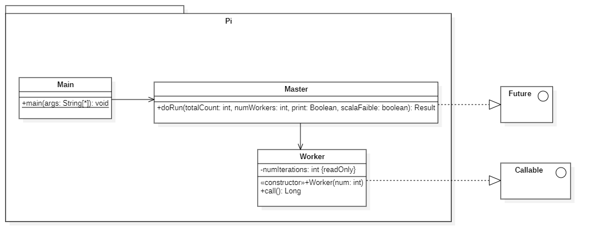

# Rapport - Calcul de $\pi$ par la méthode de Monte Carlo - Programmation Avancée

Chakib OUALI - 3FA - 2024

---

## Table des matières

- [Rapport - Calcul de $\\pi$ par la méthode de Monte Carlo - Programmation Avancée](#rapport---calcul-de-pi-par-la-méthode-de-monte-carlo---programmation-avancée)
  - [Table des matières](#table-des-matières)
  - [Introduction](#introduction)
  - [Principe de la méthode de Monte Carlo](#principe-de-la-méthode-de-monte-carlo)
    - [Généralités](#généralités)
    - [Parallélisme](#parallélisme)
  - [Implémentation](#implémentation)
  - [Paradigmes de programmation utilisés](#paradigmes-de-programmation-utilisés)
    - [Parallélisme de boucle, itération parallèle](#parallélisme-de-boucle-itération-parallèle)
    - [Modèle master-worker](#modèle-master-worker)
  - [Analyse des sources \& Réorganisation](#analyse-des-sources--réorganisation)
    - [*Assignment102*](#assignment102)
    - [*Pi*](#pi)
      - [Main](#main)
      - [Master](#master)
      - [Worker](#worker)
  - [Utilisations de sockets](#utilisations-de-sockets)
    - [Analyse des sources](#analyse-des-sources)
      - [MasterSocket](#mastersocket)
      - [WorkerSocket](#workersocket)
  - [Automatisation de l'exécution des différents programmes](#automatisation-de-lexécution-des-différents-programmes)
  - [Analyse de performances](#analyse-de-performances)
    - [Définition de scalabilité faible et forte](#définition-de-scalabilité-faible-et-forte)
    - [Mesures de performances dans le cadre de la norme ISO/IEC 25010](#mesures-de-performances-dans-le-cadre-de-la-norme-isoiec-25010)
      - [1. Functional Suitability (Adéquation fonctionnelle)](#1-functional-suitability-adéquation-fonctionnelle)
      - [2. Performance Efficiency (Efficacité des performances)](#2-performance-efficiency-efficacité-des-performances)
      - [3. Maintenability (Maintenabilité du code)](#3-maintenability-maintenabilité-du-code)
  - [Expériences et résultats](#expériences-et-résultats)
    - [Scalabilité forte](#scalabilité-forte)
    - [Pi - scalabilité forte](#pi---scalabilité-forte)
      - [Analyse des erreurs](#analyse-des-erreurs)
      - [Observations](#observations)
      - [Interprétation des résultats](#interprétation-des-résultats)
    - [PiSocket - scalabilité forte](#pisocket---scalabilité-forte)
    - [Comparaison Pi et PiSocket](#comparaison-pi-et-pisocket)
    - [Norme ISO/IEC 25010](#norme-isoiec-25010)
      - [Efficacité des performances](#efficacité-des-performances)
      - [Points clés](#points-clés)
    - [Assigment102](#assigment102)
    - [Scalabilité faible](#scalabilité-faible)
    - [Pi - scalabilité faible](#pi---scalabilité-faible)
    - [PiSocket - scalabilité faible](#pisocket---scalabilité-faible)
    - [Expérience de sockets avec plusieurs machines](#expérience-de-sockets-avec-plusieurs-machines)
  - [Conclusion](#conclusion)
  - [Références](#références)

---

## Introduction

Le calcul de $\pi$, cette constante mathématique fondamentale représentant le rapport entre la circonférence d'un cercle et son diamètre, a fasciné les mathématiciens et les scientifiques depuis des millénaires. Parmi les nombreuses méthodes développées pour estimer sa valeur, la méthode de Monte Carlo se distingue par son approche probabiliste et sa capacité à tirer parti des avancées en matière de calcul parallèle et distribué.

Ce rapport présente une analyse approfondie de l'implémentation et de l'optimisation de la méthode de Monte Carlo pour estimer la valeur de $\pi$. Cette technique de simulation, qui tire son nom des célèbres casinos de Monaco, utilise des nombres aléatoires pour résoudre des problèmes mathématiques complexes. Dans le cas présent, nous exploitons cette méthode pour approximer $\pi$ en générant des points aléatoires dans un carré et en déterminant la proportion de ces points qui tombent à l'intérieur d'un cercle inscrit dans ce carré.

L'intérêt de cette étude ne réside pas seulement dans l'estimation de $\pi$ elle-même, mais aussi dans l'exploration des possibilités offertes par le calcul parallèle et distribué pour accélérer et améliorer la précision de cette estimation. En effet, la nature intrinsèquement parallélisable de la méthode de Monte Carlo en fait un cas d'étude idéal pour examiner les avantages et les défis de la programmation parallèle moderne.

Au cours de ce rapport, nous examinerons différentes implémentations de l'algorithme, allant d'une approche utilisant des threads locaux à une version distribuée employant des sockets pour la communication entre machines. Nous analyserons en détail les performances de ces implémentations, leur scalabilité, et les compromis entre précision et temps de calcul. Cette étude nous permettra non seulement d'approfondir notre compréhension de la méthode de Monte Carlo, mais aussi d'explorer les principes fondamentaux de la programmation parallèle et distribuée, essentiels dans l'ère du calcul haute performance.

## Principe de la méthode de Monte Carlo

### Généralités

La méthode de Monte Carlo pour estimer $\pi$ repose sur le fait que la probabilité qu'un point aléatoire tombe à l'intérieur d'un cercle est proportionnelle à la surface du cercle par rapport à la surface du carré qui l'entoure. En générant un grand nombre de points aléatoires et en comptant combien de ces points tombent à l'intérieur du cercle, nous pouvons estimer la valeur de $\pi$.

On défini un carré de côté 1, et un cercle de rayon 1 inscrit dans ce carré. La surface du carré est de 1, et la surface du cercle est de $\pi$. La probabilité qu'un point aléatoire tombe à l'intérieur du cercle est donc $\frac{\pi}{4}$, car la surface du cercle est $\pi$ et la surface du carré est 4.
La probabilité qu'un point aléatoire tombe à l'intérieur du cercle se calcule donc comme suit :

$$
P(X_{p} | d_{p} < 1) = \frac{\pi}{4}
$$

Avec

- $X_{p}$ : le point aléatoire
- $d_{p}$ : la distance entre le point aléatoire et le centre du cercle
  - c'est à dire $\sqrt{x_{p}^2 + y_{p}^2}$ avec $x_{p}$ et $y_{p}$ les coordonnées du point aléatoire

On peut illustrer ce problème avec un tel graphique :


*Figure 1 : Illustration de la méthode de Monte Carlo pour estimer $\pi$*

- L'équation de la courbe (cercle) est $x^2 + y^2 = 1$.
- On place aléatoirement des points dans le carré de côté 1, et on compte combien de ces points tombent à l'intérieur du cercle.

D'un point de vue algorithmique, on peut résumer la méthode de Monte Carlo pour estimer $\pi$ comme suit :

```pseudo
nombre_de_points_dans_le_cercle = 0
nombre_de_points_total = 0
nombre_de_points_total_max = 1000000

tant que nombre_de_points_total < nombre_de_points_total_max:
    x = random(0, 1)
    y = random(0, 1)
    distance = sqrt(x^2 + y^2)

    si distance < 1:
        nombre_de_points_dans_le_cercle += 1

    nombre_de_points_total += 1
fin tant que

pi_estime = 4 * nombre_de_points_dans_le_cercle / nombre_de_points_total
```

### Parallélisme

Pour accélérer le calcul de $\pi$ par la méthode de Monte Carlo, on peut paralléliser le calcul.
Le modèle de parallélisme choisi est la parallélisation par tâches.

Les tâches dans notre algorithmes sont les suivantes :

- Compter le nombre de points aléatoires qui tombent à l'intérieur du cercle
- Agréger les résultats de chaque tâche pour obtenir une estimation de $\pi$

Les sous-tâches quant à elles sont les suivantes :

- Générer $i$ points aléatoires
- Incrémenter le compteur de points dans le cercle si le point est à l'intérieur du cercle
- Renvoyer le nombre de points dans le cercle

On peut dans un premier temps définir en tant que section critique la condition pour incrémenter le compteur de points dans le cercle et l'incrémentation elle-même.

On obtient cet algorithme :

```pseudo
nombre_de_points_dans_le_cercle = 0
nombre_de_points_total = 0
nombre_de_points_total_max = 1000000

fonction critique condition_incrementation(distance):
    si distance < 1:
        nombre_de_points_dans_le_cercle += 1

pour x de 0 à nombre_de_points_total_max:
    x = random(0, 1)
    y = random(0, 1)
    distance = sqrt(x^2 + y^2)
    condition_incrementation(distance)
fin pour

pi_estime = 4 * nombre_de_points_dans_le_cercle / nombre_de_points_total
```

On peut également faire des boucles intermédiaires pour diviser le travail entre plusieurs threads.

```pseudo
nombre_de_points_dans_le_cercle = 0
nombre_de_points_total = 0
nombre_de_points_total_max = 1000000
nombre_de_threads = 4
nombre_de_points_par_thread = nombre_de_points_total_max / nombre_de_threads

fonction critique condition_incrementation(distance):
    si distance < 1:
        nombre_de_points_dans_le_cercle += 1

pour i de 0 à nombre_de_threads:
    lancer_thread(generer_points, nombre_de_points_par_thread)
fin pour

pi_estime = 4 * nombre_de_points_dans_le_cercle / nombre_de_points_total
```

Ici, chaque thread est responsable de générer un certain nombre de points aléatoires et de compter combien de ces points tombent à l'intérieur du cercle. Les résultats de chaque thread sont ensuite agrégés pour obtenir une estimation de $\pi$.

## Implémentation

La méthode de Monte Carlo est implémentée en Java à partir de deux projets différents. Une, nommée *Assignment102*, développée par Karthik Jain (<https://gist.github.com/krthkj/9c1868c1f69142c2952683ea91ca2a37>), et l'autre, *Pi*, développée par le Dr. Steve Kautz de l'IOWA State University. Ces deux projets utilisent des threads pour exécuter les tâches Monte Carlo en parallèle et calculer la valeur de $\pi$ en fonction des résultats obtenus.

---

## Paradigmes de programmation utilisés

### Parallélisme de boucle, itération parallèle

Le parallélisme de boucle est un paradigme de programmation parallèle qui consiste à exécuter plusieurs itérations d'une boucle en parallèle. Dans le cas de la méthode de Monte Carlo, chaque itération de la boucle consiste à générer un point aléatoire et à vérifier s'il tombe à l'intérieur du cercle. En parallélisant ces itérations, on peut accélérer le calcul de $\pi$.

### Modèle master-worker

Le modèle master-worker est un modèle de programmation parallèle dans lequel un processus maître distribue des tâches à des processus esclaves (ou workers) pour maximiser l'utilisation des ressources disponibles. Dans le cas de la méthode de Monte Carlo, le processus maître est responsable de diviser le travail en tâches et de les distribuer aux workers pour effectuer les calculs. Le processus maître agrège ensuite les résultats des workers pour obtenir une estimation de $\pi$.

---

## Analyse des sources & Réorganisation

### *Assignment102*

(Parallélisme de boucle, paradigme d'itération parallele)

À l'origine, le code source de *Assignment102* était contenu dans un seul fichier Java avec trois classes : `Assignment102`, `PiMonteCarlo` et `MonteCarlo`. La première classe est en réalité le point d'entrée du programme, qu'on inscrit dans un fichier séparé `Main.java`. Les deux autres classes sont des classes utilitaires pour le calcul de $\pi$ par la méthode de Monte Carlo. Pour une meilleure organisation du code, nous avons décidé de séparer ces classes dans des fichiers distincts : `Main.java`, `PiMonteCarlo.java` et `MonteCarlo.java`.

`Main.java` contient les appels aux méthodes de calcul de $\pi$ et l'affichage des résultats. On remarque qu'elle affiche la valeur estimée de $\pi$ par le programme, la différence avec la valeur réelle de $\pi$ (récupérée de `Math.PI`) et le temps d'exécution du programme.

`PiMonteCarlo.java` contient la classe `PiMonteCarlo` qui initialise et appel les threads pour le calcul de $\pi$ par la méthode de Monte Carlo. Cette classe utilise la classe `MonteCarlo` pour effectuer les calculs.

`MonteCarlo.java` contient la classe `MonteCarlo` qui effectue les calculs de Monte Carlo pour estimer la valeur de $\pi$. Cette classe implémente l'interface `Runnable` pour être exécutée par un thread.

Ci-après, le diagramme UML des classes *Assignment102* après réorganisation :


### *Pi*

(Paradigme master-worker)

Le code source de *Pi* est également organisé en trois classes : `Pi`, `Master` et `Worker`. La classe `Pi` est le point d'entrée du programme. Et les deux classes suivent le modèle maître-esclave pour le calcul de $\pi$ par la méthode de Monte Carlo. Comme pour *Assignment102*, nous avons décidé de séparer ces classes dans des fichiers distincts : `Main.java` qui correspond à la classe `Pi`, `Master.java` et `Worker.java`.

#### Main

`Main.java` contient l'appel à la classe `Master` pour lancer le calcul de $\pi$ par la méthode de Monte Carlo. Elle affiche également les résultats obtenus.

#### Master

`Master.java` contient la classe `Master` qui initialise et gère les tâches de calcul de Monte Carlo. Elle utilise la classe `Worker` pour effectuer les calculs.

#### Worker

`Worker.java` contient la classe `Worker` qui effectue les calculs de Monte Carlo pour estimer la valeur de $\pi$. Cette classe implémente l'interface `Callable` pour renvoyer un résultat.

Ce programme suit le paradigme master-worker pour paralléliser le calcul de $\pi$ par la méthode de Monte Carlo. Le maître initialise les workers, leur envoie les tâches à effectuer et agrège les résultats pour obtenir une estimation de $\pi$. Dans le code, le maître est représenté par la classe `Master` et les workers par la classe `Worker`.

Ci-après, le diagramme UML des classes *Pi* après réorganisation :



## Utilisations de sockets

### Analyse des sources

Le code source dédié à la programmation à mémoire distribuée utilise des sockets en Java pour envoyer et recevoir des messages entre les machines. Deux fichiers sont à notre disposition : `MasterSocket.java` et `WorkerSocket.java`. On en déduit que le programme suit le modèle master-worker.

#### MasterSocket

Dans un premier temps, on initialise un nombre de workers avec leurs ports respectifs. Pour chaque worker, on crée un socket et on envoie le nombre d'itérations à effectuer pour le calcul de $\pi$. Ensuite, on attend les résultats de chaque worker et on les agrège pour obtenir une estimation de $\pi$.

#### WorkerSocket

Chaque worker crée un socket pour recevoir le nombre d'itérations à effectuer pour le calcul de $\pi$. Pour l'instant le worker n'effectue pas le calcul de Pi.

Pour compléter le programme, il faudrait ajouter la méthode de Monte Carlo pour le calcul de $\pi$ dans la classe `WorkerSocket`. Pour cela, on utilise le code de la `Pi` pour calculer la valeur de $\pi$. On envoie ensuite le résultat au maître pour l'agrégation.

Voici le diagramme UML des classes *PiSocket* :


Pour lancer le programme, il faut exécuter nos WorkerSocket avec les ports correspondants, puis exécuter le MasterSocket avec les ports des workers définit précédemment.

---

## Automatisation de l'exécution des différents programmes

Pour automatiser l'exécution des différents programmes *Assignment102*, *Pi* et *PiSocket*, il a fallu créer une classe main sous cette forme :

```java
...
 public static void main(String[] args) throws Exception {

  int workers;
  int numberOfRuns;
  int totalCount;
  String algo = "";

  if (args.length > 0) {
      workers = Integer.parseInt(args[0]);
      numberOfRuns = Integer.parseInt(args[1]);
      totalCount = Integer.parseInt(args[2]);
      algo = args[3];

  } else {
      workers = 5;
      numberOfRuns = 10;
      totalCount = 10000000;
      algo = "pi";
  }

  // Assignment 102
  if (algo.equals("ass102")) {
      runAssignment102(numberOfRuns, totalCount, machineName, workers);
  }
  if (algo.equals("pi")) {
      runPi(numberOfRuns, totalCount, machineName, workers);
  }
  if (algo.equals("socket")) {
      runMasterWorkerSocket(workers, totalCount, numberOfRuns);
  }
}
```

L'objectif étant de lancer le programme avec les paramètres qui nous intéressent. Par exemple, pour lancer le programme *Assignment102* avec 5 workers, 10 runs et 10000000 itérations, on exécute la commande suivante :

```bash
java Main 5 10 10000000 ass102
```

Pour prévoir les tests des différents algorithmes et l'analyse de performance, on a ajouté une classe permettant d'inscrire les résultats dans un fichier. Il s'agit de la classe `FileWriterUtil`. Cette classe créer un fichier dans le répertoire `out` avec en paramètre un objet `Result`. Ces fichiers sont créés dans notre classe `Main` après chaque exécution des algorithmes.

Un fichier de résultat se présente sous cette forme :

```txt
NbProcess Error Estimation Ntot Time Total
1-------------------
1 2.2557144351084918E-4 3.140884 1000000 58 785221
1 3.664849447910635E-4 3.142744 1000000 23 785686
...
2-------------------
2 0.0010463948616796842 3.14488 1000000 9 786220
...
```

---

## Analyse de performances

### Définition de scalabilité faible et forte

La scalabilité est la capacité d'un système à s'adapter à une charge de travail croissante ou à augmenter le nombre de ressources pour améliorer les performances. On distingue deux types de scalabilité :

- La scalabilité forte : la capacité d'un système à maintenir un niveau de performance constant lorsqu'on augmente le nombre de ressources (par exemple, le nombre de processeurs).
- La scalabilité faible : la capacité d'un système à maintenir un niveau de performance constant lorsqu'on augmente la charge de travail (par exemple, le nombre de tâches à effectuer).

Pour mesurer la scalabilité, on utilise le speedup, qui est le rapport entre le temps d'exécution d'un programme sur un seul processeur et le temps d'exécution du même programme sur plusieurs processeurs. On peut calculer le speedup comme suit :

$$
\text{Speedup} = \frac{T_{1}}{T_{n}}
$$

où :

- $T_{1}$ est le temps d'exécution du programme sur un seul processeur.
- $T_{n}$ est le temps d'exécution du programme sur $n$ processeurs.

Le speedup idéal est linéaire, c'est-à-dire que le speedup est égal au nombre de processeurs utilisés. Cependant, en pratique, le speedup est souvent inférieur au nombre de processeurs en raison des surcharges de communication et de synchronisation entre les processeurs (overhead).


*Figure 2 : Speedup idéal*  

Dans cette figure la droite noire correspond le speedup idéal dans le cas de la scalabilité forte. La droite bleue correspond quant à elle à la scalabilité faible.

Ainsi, grâce à l'automatisation de l'exécution des différents programmes et de l'écriture des résultats dans un fichier, on peut facilement analyser les performances des algorithmes et mesurer leur scalabilité.

### Mesures de performances dans le cadre de la norme ISO/IEC 25010

La norme *ISO/IEC 25010* définit un cadre pour évaluer la qualité des logiciels en se basant sur plusieurs critères. Dans le cas du calcul de $\pi$ par la méthode de Monte Carlo, plusieurs mesures peuvent être appliquées pour évaluer les performances du programme.  

#### 1. Functional Suitability (Adéquation fonctionnelle)  

L’adéquation fonctionnelle mesure la capacité du logiciel à fournir des fonctions qui répondent aux besoins spécifiés. Dans notre cas, cela se traduit par la justesse du calcul de $\pi$.  

- **Functional Correctness (Correction fonctionnelle)**  
  - On compare la valeur estimée de $\pi$ avec la valeur réelle (`Math.PI` en Java).  
  - Une erreur relative peut être calculée (c'est celle qu'on utilise dans nos programme et qu'on enregistre dans les fichiers de résultats) :  
    $\text{Erreur} = \left| \frac{\pi_{\text{estimé}} - \pi_{\text{réel}}}{\pi_{\text{réel}}} \right|$  
  - Le nombre d’itérations influence la précision du résultat.  

#### 2. Performance Efficiency (Efficacité des performances)  

Ce critère mesure la rapidité et l’utilisation des ressources du programme.  

- **Time Behavior (Comportement temporel)**  
  - **Temps d’exécution total** :  
    On mesure le temps nécessaire pour exécuter l’algorithme en fonction du nombre de threads (`T_n`).  
  - **Speedup** :  
    On évalue l’accélération obtenue en augmentant le nombre de cœurs processeurs (`P`) :  
    $\text{Speedup} = \frac{T_1}{T_P}$  
  - **Évolution du temps d’exécution** en fonction du nombre d’itérations (`N`).  

- **Resource Utilization (Utilisation des ressources)**  
  - Utilisation du processeur (`CPU usage`).  
  - Occupation mémoire (quantité de RAM utilisée).  
  - Bande passante consommée dans le cas de la version distribuée (sockets).  

- **Capacity (Capacité maximale)**  
  - Combien de threads (workers) peuvent être utilisés **avant que la performance ne se dégrade** ?  
  - Influence du **nombre de processus (`P`) sur l’overhead** (communication entre threads ou machines).  

#### 3. Maintenability (Maintenabilité du code)  

- **Modularity (Modularité)** :  
  - Séparation des responsabilités en classes (`Main`, `Master`, `Worker`).  
  - Découpage du code en fichiers distincts (`Assignment102.java`, `Pi.java`, etc.).  
- **Reusability (Réutilisabilité)** :  
  - Possibilité de réutiliser la classe `Worker` dans d’autres simulations Monte Carlo.  
- **Testability (Testabilité)** :  
  - Facilité à tester la précision du calcul en automatisant la comparaison avec la vraie valeur de $\pi$.  

En appliquant ces critères de la norme *ISO/IEC 25010*, nous pouvons analyser les performances du programme et identifier des pistes d’amélioration. Les principaux défis sont la gestion de l’overhead et l’optimisation du parallélisme pour maximiser le speedup et l’efficacité de l’algorithme.

---

## Expériences et résultats

Les expériences menées sur les différents programmes *Assignment102*, *Pi* et *PiSocket* ont permis de mesurer les performances des algorithmes et d’analyser leur scalabilité. Les résultats obtenus ont été enregistrés dans des fichiers de résultats pour une analyse plus approfondie.
Ces expériences sont effectuées sur un ordinateur personnel avec une configuration matérielle spécifique.

Configuration :

- i5-12500H
- 16 Go de RAM
- 12 coeurs
- 16 threads
  
Pour chaque programme, on les exécute avec un nombre de points différents, et un nombre de workers allant de 1 jusqu'à un nombre dépassant le nombre de coeurs de la machine. Chaque exécution est répétée plusieurs fois pour obtenir une moyenne des résultats.

### Scalabilité forte

Pour rappel, la scalabilité forte est la capacité d'un système à maintenir un niveau de performance constant lorsqu'on augmente le nombre de ressources (par exemple, le nombre de processeurs). Dans le cas de la méthode de Monte Carlo, la scalabilité forte se traduit par un speedup linéaire, c'est-à-dire que le speedup est égal au nombre de processeurs utilisés.

### Pi - scalabilité forte

  

*Figure 3 : Speedup de l'algorithme Pi sur un ordinateur personnel*  
Cette figure montre l'évolution du speedup en fonction du nombre de workers utilisés pour l'algorithme Pi. On a effectué l'expérience avec des workers de 1 à 20 et avec $10^7$ et $10^9$ points. On observe que le speedup augmente avec le nombre de workers, mais il atteint un plateau à partir de 16 workers. Cela s'explique par les limitations matérielles de la machine, qui ne peut pas gérer plus de 16 threads en parallèle.

#### Analyse des erreurs

Le graphique ci-dessous illustre l'évolution de l'erreur pour différentes tailles d'échantillons ($10^6$, $10^7$, $10^8$, et $10^9$ points). Chaque série de données inclut :

- Les **erreurs individuelles** (points colorés).
- Les **médianes** des erreurs pour chaque taille d'échantillon (points foncés).


*Figure 4 : Erreur en fonction du nombre de points pour l'estimation de $\pi$.*  

#### Observations

**Diminution logarithmique de l'erreur**  

L'erreur diminue proportionnellement au logarithme du nombre de points. Pour $10^6$ points, l'erreur est généralement autour de $10^{-3}$, tandis qu'elle atteint approximativement $10^{-7}$ pour $10^9$ points.

**Stabilité des médianes**  

Les médianes (représentées par les points foncés) montrent une stabilité relative pour chaque taille d'échantillon. Cette constance indique que les estimations sont cohérentes malgré les fluctuations inhérentes à la nature aléatoire de la méthode Monte Carlo.

**Dispersion des erreurs individuelles**  

La dispersion est plus importante pour les échantillons plus petits ($10^6$), ce qui reflète une variabilité accrue dans les estimations. Pour les échantillons plus grands ($10^9$), la dispersion devient nettement moins importante, démontrant une convergence plus stable vers la valeur réelle de $\pi$.

#### Interprétation des résultats

**Convergence statistique**  

La méthode Monte Carlo repose sur la loi des grands nombres : plus le nombre de points générés est important, plus l'estimation converge vers la valeur réelle. Cette propriété fondamentale explique pourquoi nous observons une diminution logarithmique de l'erreur avec l'augmentation du nombre de points dans nos expériences.

**Impact du parallélisme**  

Le parallélisme joue un rôle crucial dans notre implémentation car il permet d'augmenter rapidement le nombre total de points générés, améliorant ainsi la précision tout en réduisant le temps d'exécution. Toutefois, nos résultats montrent qu'au-delà d'un certain seuil (lié aux limitations matérielles), les gains deviennent marginaux en raison des surcharges liées à la synchronisation entre threads ou processus.

**Limites pratiques**  

Bien que théoriquement l'erreur puisse être réduite indéfiniment en augmentant le nombre de points, cela entraîne une augmentation exponentielle du temps et des ressources nécessaires. Nos expériences démontrent qu'une balance doit être trouvée entre précision souhaitée et coûts computationnels, particulièrement dans des environnements où les ressources sont limitées.

---

### PiSocket - scalabilité forte


*Figure 5 : Speedup de l'algorithme PiSocket sur un ordinateur personnel*  

De la même manière que pour l'algorithme Pi, on observe une augmentation du speedup avec le nombre de workers, mais un plateau à partir de 16 workers. Cela confirme que la machine ne peut pas gérer plus de 16 threads en parallèle.

Ci-dessous, le graphique de l'erreur pour l'algorithme PiSocket :


*Figure 6 : Erreur en fonction du nombre de points pour l'estimation de $\pi$ avec PiSocket*

Le graphique est similaire à celui de l'algorithme Pi, avec une diminution logarithmique de l'erreur et une convergence statistique vers la valeur réelle de $\pi$. Les observations et interprétations sont également similaires.

---

### Comparaison Pi et PiSocket

Pi et PiSockets sont des algorithmes similaires, mais PiSocket utilise des sockets pour la communication entre le maître et les workers. Les performances des deux algorithmes sont comparées ci-dessous.


*Figure 7 : Comparaison du speedup entre Pi et PiSocket sur un ordinateur personnel*  

Cette figure montre à gauche les résultats pour PiSocket et à droite pour Pi. On observe que les deux algorithmes ont des performances similaires en termes de speedup, avec un plateau à partir de 16 workers. Cependant, on semble remarquer que Pi est légèrement plus performant que PiSocket.

Pour confirmer ceci, la figure ci-dessous superpose les deux graphiques :


*Figure 8 : Comparaison du speedup entre Pi et PiSocket superposés sur un ordinateur personnel*  

À gauche, on a les courbes pour $10^7$ points, et à droite pour $10^9$ points. On observe que les courbes suivent plus ou moins la même tendance. La différence entre les deux courbes correspond à l'overhead lié à l'utilisation des sockets dans PiSocket.
Cependant, l'overhead semble plus faible avec $10^9$, ce qui indique que l'utilisation des sockets est plus efficace pour des échantillons plus importants.

### Norme ISO/IEC 25010

#### Efficacité des performances

**Comportement temporel** :

- Le temps d'exécution s'améliore jusqu'à 16 workers.
- Un plateau est atteint à partir de 16 workers en raison des limites matérielles.

**Utilisation des ressources** :

- L'utilisation des ressources est optimale jusqu'à 16 threads, correspondant à la capacité maximale de la machine.
- Une légère baisse d'efficacité est observée au-delà de 16 threads.

#### Points clés

- **Scalabilité** : L'algorithme montre une bonne scalabilité jusqu'à 16 workers, mais est limité par le matériel au-delà.
- **Précision** : La précision augmente avec le nombre de points, 10^9 points étant plus précis que 10^7.
- **Limite matérielle** : La limite matérielle est identifiée à 16 threads parallèles.

L'algorithme présente de bonnes performances selon la norme ISO/IEC 25010, avec une scalabilité efficace jusqu'aux limites matérielles. L'augmentation du nombre de points améliore la précision, mais le gain en speedup est limité par les capacités de la machine au-delà de 16 workers.

### Assigment102

Pour Assignment102, on exécute uniquement avec 8 et 10 workers, avec un nombre respectifs de points de $10^6$ et $10^7$. Les résultats sont les suivants :


On remarque que la courbe ressemble beaucoup à une courbe de scalabilité faible. Cela montre l'inefficacité de l'algorithme pour la scalabilité forte.

Si on regarde du côté de l'erreur, on a le graphique suivant :


On constate malgré tout une diminution de l'erreur en fonction du nombre de points.

---

### Scalabilité faible

Pour la scalabilité faible, on exécute les algorithmes avec un nombre fixe de workers et on augmente la charge de travail (le nombre de points à générer). On mesure le temps d'exécution en fonction du nombre de points pour évaluer la capacité des algorithmes à maintenir un niveau de performance constant malgré une charge de travail croissante.

### Pi - scalabilité faible


*Figure 9 : Scalabilité faible de l'algorithme Pi sur un ordinateur personnel*  

Cette figure montre l'évolution du speedup en fonction du nombre de workers utilisés pour l'algorithme Pi. Chaque worker génère $10^7$ points. On observe que le speedup est presque toujours inférieur à 1. Plus le nombre de workers augmente, plus on se rapproche de $\frac{1}{2}$. Avec $10^6$ points, on passe légèrement au-dessus de 1 au début, ce qui est probablement lié à une marge d'erreur due au faible nombre de points.

Concernant les erreurs, on peut observer le graphique suivant :


*Figure 10 : Erreur en fonction du nombre de points pour l'estimation de $\pi$ avec Pi en scalabilité faible*  

On constate comme pour la scalabilité forte une diminution de l'erreur en fonction du nombre de points.

### PiSocket - scalabilité faible


*Figure 11 : Scalabilité faible de l'algorithme PiSocket sur un ordinateur personnel*  

Pour PiSocket, on observe un speedup inférieur à 1 pour la plupart des configurations. Cela indique que l'augmentation de la charge de travail (le nombre de points) n'améliore pas les performances de l'algorithme. On peut également observer que le speedup est plus faible pour PiSocket que pour Pi.

Pour les erreurs, on a le graphique suivant :


*Figure 12 : Erreur en fonction du nombre de points pour l'estimation de $\pi$ avec PiSocket en scalabilité faible*  

Les erreurs pour PiSocket sont plutôt similaires à celles de Pi, avec une diminution de l'erreur en fonction du nombre de points.

### Expérience de sockets avec plusieurs machines

La dernière expérience consiste à exécuter l'algorithme PiSocket sur plusieurs machines en utilisant des sockets pour la communication. On a utilisé plusieurs machines de la salle G26 de l'IUT pour effectuer cette expérience. Chaque machine a été configurée pour exécuter un worker avec un nombre défini de points à générer. Le maître a été exécuté sur une machine distincte pour coordonner les workers et agréger les résultats. Une variante consiste à faire une double parallélisation, avec un nombre de workers proportionnel au nombre de threads de chaque machine.

TODO

## Conclusion

La conclusion de cette étude approfondie sur la méthode de Monte Carlo pour l'estimation de $\pi$ met en lumière plusieurs aspects importants de la programmation parallèle et distribuée.

Tout d'abord, les implémentations parallèles (Pi et PiSocket) ont démontré une amélioration significative des performances par rapport à une exécution séquentielle. L'analyse de la scalabilité forte a révélé un speedup quasi-linéaire jusqu'à 16 workers sur la machine de test, ce qui correspond aux capacités matérielles de l'ordinateur utilisé. Cette observation souligne l'importance de prendre en compte les contraintes matérielles lors de la conception d'algorithmes parallèles.

L'expérimentation a clairement mis en évidence les limites imposées par le matériel, avec un plafonnement des performances au-delà de 16 threads. Ce phénomène illustre la nécessité d'optimiser l'utilisation des ressources disponibles et de considérer les compromis entre le nombre de workers et l'efficacité globale du système.

En ce qui concerne la scalabilité faible, les résultats se sont révélés moins probants, avec des speedups généralement inférieurs à 1. Cela indique que l'augmentation de la charge de travail n'améliore pas proportionnellement les performances, soulignant l'importance d'une conception soigneuse des algorithmes pour gérer efficacement des charges de travail croissantes.

L'étude a également mis en évidence le compromis entre précision et performance. L'augmentation du nombre de points améliore la précision de l'estimation de $\pi$, mais au prix d'un temps de calcul plus long. Il est donc crucial de trouver un équilibre optimal entre ces deux facteurs en fonction des besoins spécifiques de l'application.

La comparaison entre les approches Pi (utilisant des threads) et PiSocket (utilisant des sockets) a montré que l'implémentation Pi était légèrement plus performante. Cette différence peut être attribuée à l'overhead de communication introduit par l'utilisation des sockets dans PiSocket.

Enfin, l'analyse des performances dans le cadre de la norme ISO/IEC 25010 a démontré que les algorithmes présentent de bonnes performances en termes d'efficacité et de précision. Cependant, il existe encore des opportunités d'optimisation, notamment dans la gestion de l'overhead et l'adaptation dynamique à différentes architectures matérielles.

Cette étude ouvre des perspectives pour de futures recherches, notamment dans l'optimisation des algorithmes pour une meilleure scalabilité faible et dans l'exploration de techniques avancées de parallélisation pour surmonter les limitations matérielles observées.

## Références

- Cours de Programmation Avancée, T. Dufaud.
- Code assignment102 :
  - Auteur : Karthik Jain (Software Developer, <https://www.krthkj.com>)
  - Source : <https://gist.github.com/krthkj/9c1868c1f69142c2952683ea91ca2a37>
- Code Pi :
  - Auteur : Dr. Steve Kautz, IOWA State University, <https://faculty.sites.iastate.edu/smkautz/>

- Technologies utilisées :
  - Java + bibliothèques natives - Langage de programmation
  - IntelliJ IDEA - Environnement de développement intégré
  - Visual Studio Code - Environnement de développement intégré
  - Git + GitHub - Gestion de versions et hébergement de code
  - StarUML - Modélisation UML
  - Perplexity Research - Recherches diverses
  - Python, NumPy, Matplotlib - Analyse de données
